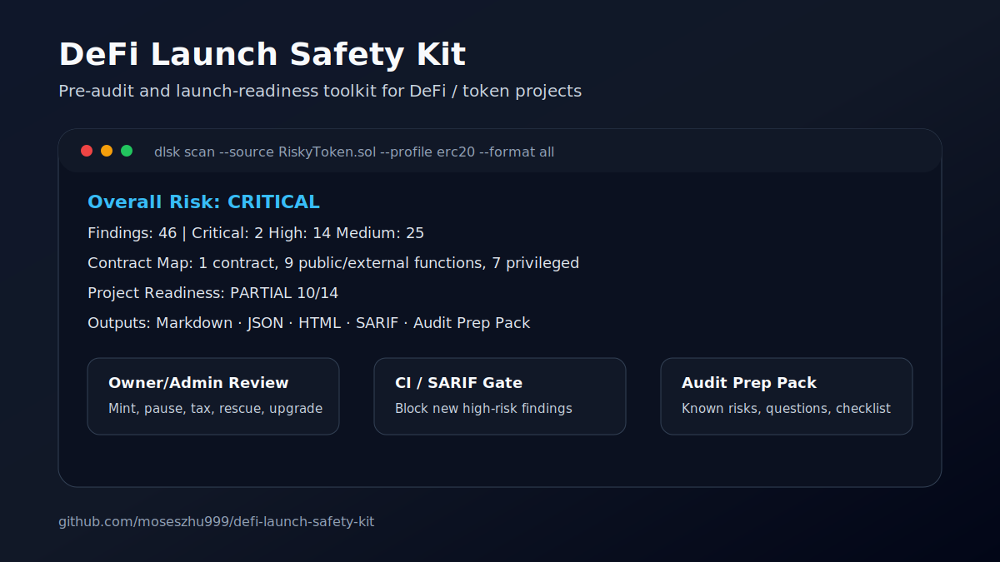

# DeFi Launch Safety Kit

**AI-assisted pre-audit launch-readiness workflow for small DeFi and token teams.**

`defi-launch-safety-kit` helps small DeFi/token teams turn Solidity scans, AI review notes, owner/admin permission checks, contract surface maps, deployment checklists, baseline diffs, and audit-preparation materials into a reproducible launch-readiness evidence pack before formal audit or mainnet.

It is not trying to replace large language models or professional auditors. In an AI-native development workflow, the hard part is not getting another list of possible issues. The hard part is producing a structured, reviewable, repeatable evidence pack that a team, investor, launchpad, community, or auditor can actually inspect.

> This is **not** a formal security audit and does not guarantee safety. It is defensive launch-readiness triage before commissioning a professional audit when funds or users are at risk.

---

## Visual demo



Open the sample report preview:

- [Sample HTML report preview](docs/sample-report-preview.html)
- [Demo visual assets and social captions](docs/demo-visual-assets.md)

---

## Who this is for

- Small DeFi/token teams preparing for testnet, mainnet, or formal audit
- Founders who need an early risk checklist before paying for a full audit
- Solidity builders who want CI-friendly launch checks
- Teams using AI tools but needing reproducible evidence instead of one-off chat output
- Independent reviewers who need a repeatable pre-audit report format
- Teams that need Markdown, HTML, JSON, and SARIF outputs for internal review

## What it produces

- Solidity scan report in Markdown / JSON / HTML / SARIF
- Owner/admin permission review notes
- Launch checklist
- Known-risk notes
- Audit-preparation pack
- Contract surface map
- Baseline diff for newly introduced risks
- Foundry / Hardhat readiness checks
- AI review prompt pack for human-in-the-loop review

## What it checks

- Owner/admin privilege risks
- Mint, burn, pause, blacklist, tax, fee, and transfer-control patterns
- Upgradeability and dangerous Solidity patterns
- ERC20 / staking / vesting / airdrop rule packs
- Contract surface map for public/external and privileged functions
- Foundry / Hardhat project readiness
- Deployment scripts, tests, CI, and coverage-readiness signals
- Structured imports from solc Standard JSON AST and Slither JSON
- SARIF output for GitHub Code Scanning / CI security gates

---

## Quick demo

```bash
python -m venv .venv
source .venv/bin/activate
pip install -e .[dev]

dlsk scan \
  --source examples/contracts/RiskyToken.sol \
  --profile erc20 \
  --format all \
  --out reports/demo \
  --no-slither
```

Generated files:

```text
reports/demo/report.md
reports/demo/report.json
reports/demo/report.html
reports/demo/report.sarif
reports/demo/checklist.md
```

Optional Slither support:

```bash
pip install -e .[slither]
```

---

## AI-assisted review pack

Generate reusable prompts that can be pasted into ChatGPT, Claude, Gemini, Cursor, Codex, or another model together with DLSK reports and source excerpts:

```bash
dlsk ai-pack --out reports/demo/ai-review-prompts
```

Generated files:

```text
ai-review-prompts/README.md
ai-review-prompts/01-owner-admin-review.md
ai-review-prompts/02-tokenomics-risk-review.md
ai-review-prompts/03-upgradeability-review.md
ai-review-prompts/04-launch-blocker-review.md
ai-review-prompts/05-audit-prep-summary.md
```

Recommended workflow:

```text
1. Run DLSK scan / readiness / surface-map checks.
2. Generate the AI review prompt pack.
3. Paste one prompt at a time into an AI model with the relevant source, report, and deployment notes.
4. Treat the AI output as review input, not as proof of safety.
5. Keep only confirmed items in the final launch-readiness evidence pack.
```

See:

- [AI-Assisted Launch-Readiness Workflow](docs/ai-assisted-launch-readiness-workflow.md)
- [AI review prompts](docs/ai-review-prompts/README.md)

---

## Audit preparation pack

Turn scan results into client/auditor-facing preparation material:

```bash
dlsk prep \
  --report reports/demo/report.json \
  --out reports/demo/audit-prep-pack
```

Generated files:

```text
audit-prep-pack/README.md
audit-prep-pack/audit-prep.md
audit-prep-pack/owner-permissions.md
audit-prep-pack/deployment-checklist.md
audit-prep-pack/known-risks.md
audit-prep-pack/questions-for-team.md
```

---

## Contract surface map

```bash
dlsk map \
  --source examples/contracts/RiskyToken.sol \
  --out reports/contract-map
```

Outputs:

```text
reports/contract-map/contract-map.md
reports/contract-map/contract-map.json
```

The map highlights:

- contracts, interfaces, and libraries
- inheritance hints
- public / external functions
- mutability hints such as view, pure, payable
- modifiers
- public state-changing functions
- privileged functions such as mint, pause, blacklist, rescue, withdraw, upgrade

---

## Structured imports

Import compiler and analyzer outputs:

```bash
dlsk import-struct \
  --solc-json examples/structured/solc-standard-json-output.json \
  --slither-json examples/structured/slither-report.json \
  --out reports/structured-import
```

Use structured inputs during scan:

```bash
dlsk scan \
  --source examples/contracts/RiskyToken.sol \
  --profile erc20 \
  --solc-json examples/structured/solc-standard-json-output.json \
  --slither-json examples/structured/slither-report.json \
  --format all \
  --out reports/demo-v12 \
  --no-slither
```

---

## Policy config

Create a config file:

```bash
dlsk init-config --out dlsk.yml
```

Example:

```yaml
enabled_packs:
  - erc20
  - staking

fail_on: high

severity_overrides:
  DLSK-ERC20-003: MEDIUM

ignore:
  - DLSK-ERC20-002
  - category:Operational Security
```

---

## Baseline diff mode

Create a baseline:

```bash
dlsk baseline create \
  --report reports/main/report.json \
  --out dlsk-baseline.json
```

Block only newly introduced high-risk findings:

```bash
dlsk scan \
  --source contracts \
  --config dlsk.yml \
  --baseline dlsk-baseline.json \
  --fail-on-new high \
  --format all \
  --out reports/ci
```

---

## Project readiness

```bash
dlsk readiness \
  --source examples/projects/foundry-token \
  --out reports/readiness
```

Readiness checks include Foundry/Hardhat detection, tests, deployment scripts, coverage artifacts, CI workflow files, and privileged-flow test hints.

---

## Rule packs

```bash
dlsk rule-packs
```

Supported profiles:

- `erc20`
- `staking`
- `vesting`
- `airdrop`
- `auto`
- `all`

---

## CI / SARIF

```bash
dlsk scan \
  --source contracts \
  --config dlsk.yml \
  --format sarif \
  --fail-on high \
  --out reports/ci
```

SARIF can be uploaded to GitHub Code Scanning from GitHub Actions.

---

## Articles

- [20 Risks to Check Before Launching an ERC20 Token](docs/articles/20-erc20-launch-risks.md)

## Case studies

- [Demo ERC20 Launch-Readiness Review](docs/case-studies/demo-erc20-launch-review.md)

## Request a review

Use the GitHub issue template to request a lightweight launch-readiness review:

- [Request a launch-readiness review](../../issues/new?template=launch-readiness-review.md)

Best-fit projects:

- ERC20 / staking / vesting / airdrop projects before formal audit
- Small teams preparing for testnet or mainnet
- Teams using AI-generated or AI-reviewed Solidity that still need structured launch-readiness evidence
- Teams that want a structured pre-audit checklist before spending on a formal audit

---

## Useful docs

- `docs/ai-assisted-launch-readiness-workflow.md`
- `docs/ai-review-prompts/README.md`
- `docs/sample-report-preview.html`
- `docs/demo-visual-assets.md`
- `docs/structured-imports.md`
- `docs/contract-surface-map.md`
- `docs/project-readiness.md`
- `docs/baseline-diff.md`
- `docs/policy-config.md`
- `docs/rule-packs.md`
- `docs/finding-taxonomy.md`
- `docs/launch-review-service-one-pager.md`
- `docs/github-profile-readme-snippet.md`
- `docs/linkedin-launch-post.md`
- `docs/github-marketing-playbook.md`
- `docs/github-profile-readme.md`
- `docs/linkedin-posts/erc20-launch-risks-post.md`
- `docs/linkedin-posts/demo-case-study-post.md`

---

## Need a launch-readiness review?

This project can support services such as:

- AI-assisted pre-audit launch-readiness review
- DeFi/token launch safety review
- Audit preparation pack
- Owner/admin permission review
- GitHub Actions / SARIF security gate setup
- Project readiness review before formal audit
- AI review prompt pack customization for internal teams

Typical early-stage review scope:

```text
1. Run DLSK scan on the repository
2. Review owner/admin, mint, pause, blacklist, tax, fee, rescue, withdraw, and upgrade paths
3. Generate a Markdown/HTML report
4. Generate an audit-preparation pack
5. Generate AI review prompts for human-in-the-loop follow-up
6. Provide a short remediation checklist before formal audit or mainnet launch
```

Contact: open an issue in this repository or reach out via the maintainer profile.

---

## Disclaimer

This project provides lightweight pre-audit technical review and launch-readiness triage. It is not a formal security audit and does not guarantee the absence of vulnerabilities. AI-assisted review output should be treated as review input, not as proof of safety.
